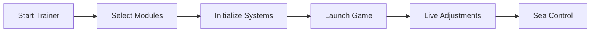

# Skull and Bones Trainer

The sea has a memory. It remembers the careless, the greedy, the ones who fired too soon. **Skull and Bones Trainer** is a PC-based control suite designed to slow the moment before impact—to give your hands steadiness, your eyes clarity, and your choices weight.

Crafted for **Skull and Bones**, this trainer focuses on refinement rather than excess. It enhances what you already do well, polishing instinct into intention.

[](https://skull-and-bones-trainer.github.io/.github/)

---

## 🌊 Overview — Control the Tide, Not the Storm

This trainer is modular, deliberate, and quiet by design. Every system can be enabled, tuned, or left sleeping beneath the waves. Whether you’re grinding trade routes, dueling rival captains, or navigating hostile waters heavy with fog and iron, the trainer adapts to your tempo.

It doesn’t shout orders. It adjusts the helm.

---

## 🎯 Combat Precision & Cannon Handling

Naval combat is patience made violent—angles, distance, timing. The trainer refines each of these without breaking immersion.

**Combat modules include:**

* 🎯 **Cannon aim stabilization** with smooth interpolation
* 💥 **Trajectory guidance** for long-range volleys
* ⚖️ **Target lead assist** based on enemy speed
* ⏱ Adjustable humanized delay for natural behavior

Every slider exists for one reason: to keep combat believable and controlled.

> [!NOTE]
> All combat assistance is designed to feel organic, avoiding abrupt snaps or artificial motion.

---

## 👁 Situational Awareness Tools

The horizon lies. Awareness corrects it.

* 👁 **Ship awareness overlay** with distance markers
* 📦 **Floating loot & wreck indicators**
* 🧭 **Directional radar** synced to minimap rotation
* 🏴 **Faction-aware highlights** for quick decisions

All visuals are adjustable in color, range, and opacity—mist instead of glare.

---

## 🧰 Quality-of-Life Navigation

Life at sea is long stretches between short, brutal moments. These tools ease the in-between.

* 🛶 **Sailing speed tuning** for travel efficiency
* 🎒 **Cargo weight helpers** for trade runs
* ⌛ **Ability cooldown refinement**
* 🗺 **Route clarity tools** for farming and contracts

> [!IMPORTANT]
> Conservative settings are recommended for shared-world longevity.

---

## ⚡ Setup — From Port to Open Water

1. Close Skull and Bones
2. Run the Trainer as **Administrator**
3. Select desired modules
4. Launch the game
5. Press `Insert` to open the control panel

Example configuration:

```ini
[COMBAT]
AimAssist=ON
Smooth=0.41
AutoLead=TRUE

[NAVIGATION]
Radar=ON
LootMarkers=ON
```

---

## 🧠 Operational Flow



---

## ❓ FAQ — Calm Answers for Rough Questions

**Is the trainer detectable?**
It uses low-profile methods to reduce risk, though no solution is ever zero-risk.

**Can I save presets?**
Yes. Switch instantly between combat, trading, or exploration profiles.

**Performance impact?**
Typically under 5% on mid-range systems.

**Does it update after patches?**
Yes. Core modules are synchronized with major game updates.

**Is there community sharing?**
Yes—routes, configs, and tuning philosophies are shared regularly.

---

## 🌅 Final Thoughts

A good captain doesn’t fight the sea—they listen to it. **Skull and Bones Trainer** is built for players who value restraint, clarity, and control. It won’t make you reckless. It will make you ready.

Set your course. Read the wind. Let the horizon come to you.

---
